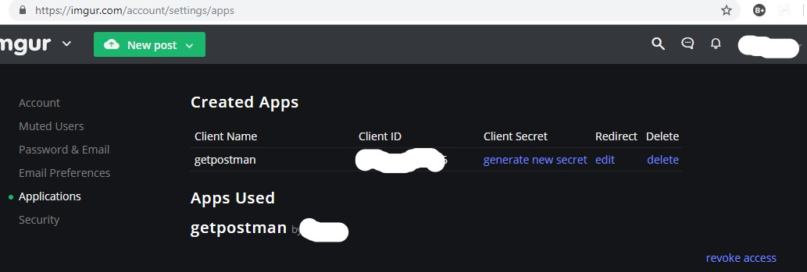
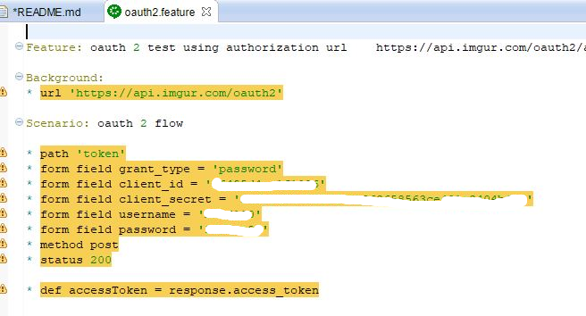
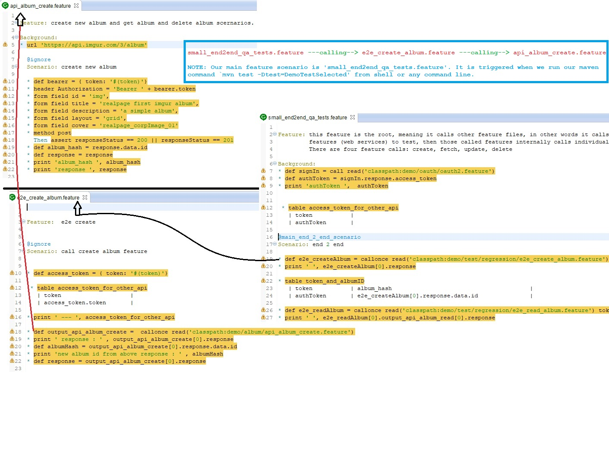
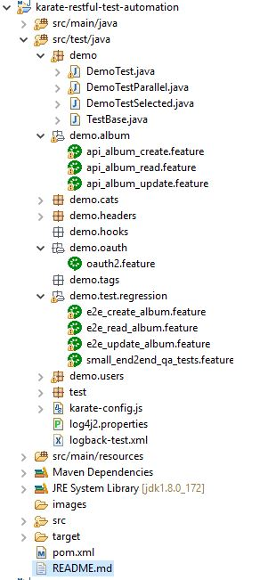
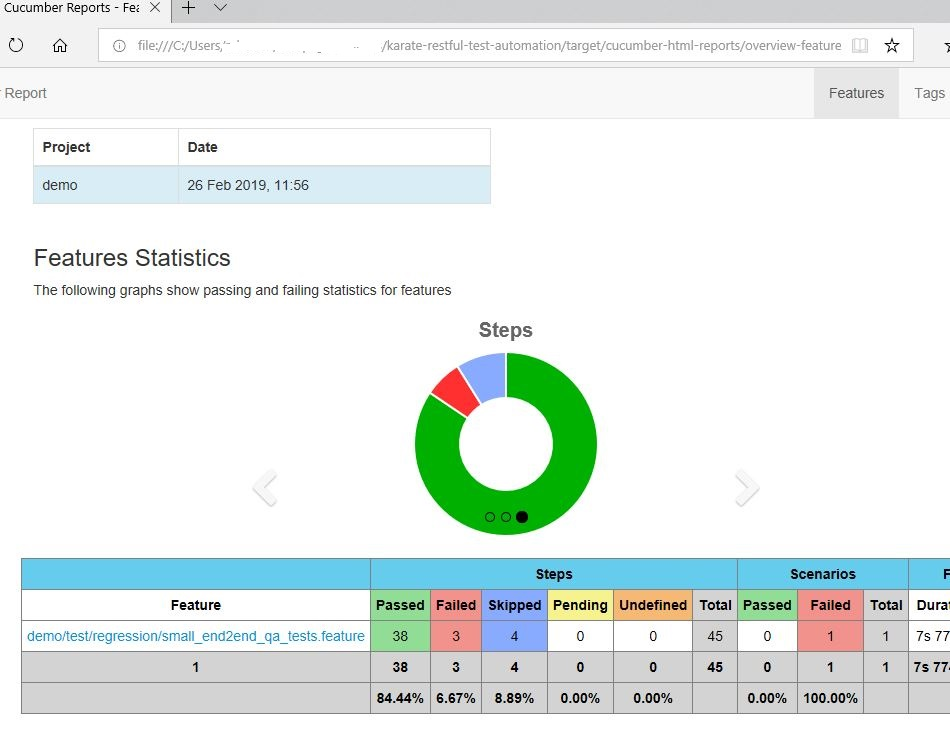

## Objective: RESTFul API Test cases and Test automation using ** [Karate](https://github.com/intuit/karate#quickstart)**  


1. This work helps to understand what is karate framework (open source tool) and how it help's to test restful webservices (`QA perspective`).
2. I have used ** [imgur account and its webservices](https://imgur.com)**
3. Test CRUD operations. 
4. In this project work I have automated basic CRUD operations, and considered only positive cases.
5. This work is restful webservices testing.

Getting started:
----------------

1. Get new user account with `imgur.com`

2. Next, You need an fake or real application. Do not worry if you don't have one.

3. You can use `https://www.getpostman.com/oauth2/callback`. consider this as your application.

4. Now, register the `url` with `imgur`. see this link [imgur](https://apidocs.imgur.com/)

5. Go to `REGISTRATION QUICKSTART` section of the above page.

6. Follow the steps as shown.

7. You will have new `Client ID` and `Client Secret`.

8. You can also see the `Client ID` and `Client Secret` in `imgur` website under user account settings section.

9. You need this two `Client ID` and `Client Secret` to use imgur webservices, meaning, you can do post, get, put or delete operations.

10. This how your `imgur` user account settings will look like. see below image:


&nbsp;&nbsp;



11. Next, please follow `Download code` section (see below), and then open feature file `oauth2.feature` which is under `src\test\java\demo\oath` package.

12. Replace `Client ID` and `Client Secret` with your's.

13. Replace `username` and `password` with your's. Note, these two will be your `imgur` user credentials.


&nbsp;&nbsp;



Technology stack:
-----------------

1. java 8
2. karate open-source tool
3. maven
4. junit 4
5. windows 10 OS
6. cucumber-reporting


Download code:
---------------

Do git clone for downloading the project to your local machine and then import project to your IDE.

Install with [git](https://git-scm.com/downloads):
	
```sh
$ git clone https://github.com/meharlist/restful-test-automation.git
``` 


Running test from command line:
------------------------------

1. You can use git bash or any choice of shell.

2. Go to your project directory from terminal and hit below command:

```sh
$ mvn test -Dtest=DemoTestSelected
```

3. Test results or reports can be found in `cucumber-html-reports` folder which is under `target` directory.


Running test from Jenkins:
-------------------------------

1. in progress...


Cucumber feature files flow:
----------------------------

I have seperated `api` to respective feature files and I consider them as `called` feature files, in other words, the test feature files `e2e` feature will call
`api` feature file. see below image;

1. During this design I have considered `Calling feature` and `Called feature` as fundamental principle, this helps my scenarios to be modular and easy to maintain.

&nbsp;&nbsp;



Project Structure:
------------------

&nbsp;&nbsp;



Cucumber Report:
----------------

&nbsp;&nbsp;
